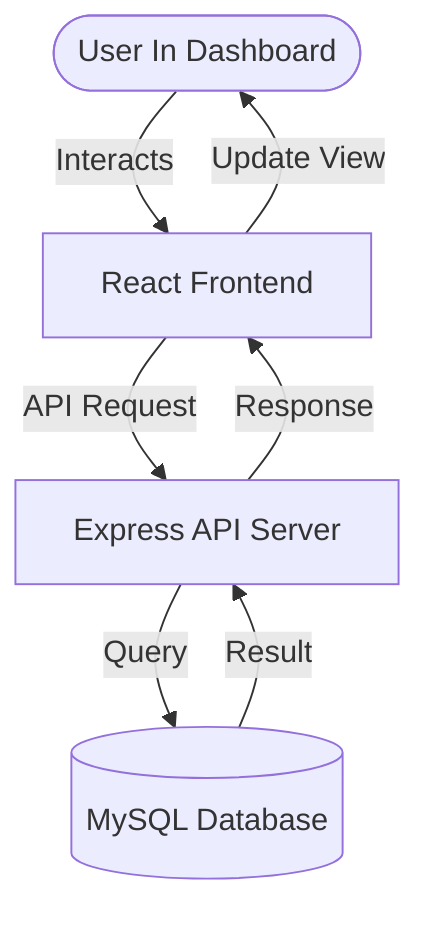

# 👋 User Management System


A simple, fast, and professional app to manage user records. Built to practice core full-stack development using modern tools like React, TypeScript, and Express.

## Project Description

This project is a complete User Management system. It lets you create, view, edit, and delete user profiles easily. I built it to learn how to connect React components to a real database (MySQL) using a Node.js API with strict TypeScript types for both.

---

## 🛠️ Tech Stack

- **Frontend:** React + TypeScript + Vite
- **Backend:** Node.js + Express + TypeScript
- **Database:** MySQL
- **Styling:** CSS (Custom)

---

## ✨ Features

- **Add Users:** Create new user entries with name, email, and age.
- **View Users:** A clean list of all current users fetched directly from the DB.
- **Update Records:** Edit any existing user information instantly.
- **Delete Users:** Remove records with a single click.
- **Full-stack Flow:** Seamless communication between client, server, and database.

---

## 📁 Folder Structure

```text
UserManagement/
├── frontend/             # React App
│   ├── src/
│   │   ├── components/   # UI bits (Button, Form, Table)
│   │   ├── hooks/        # Custom logic for API calls
│   │   ├── pages/        # Main views (UserList, UserForm)
│   │   └── types/        # TS interfaces
├── backend/              # Node.js Express Server
│   ├── src/
│   │   ├── config/       # DB connection & init
│   │   ├── controllers/  # Route handlers
│   │   ├── services/     # Business logic
│   │   └── index.ts      # Server entry point
├── screenshots/          # App previews & banner
└── README.md             # This file
```

---

## 🚀 Setup & Running

### 1. Database Setup
Make sure you have **MySQL** installed. Use a tool like MySQL Workbench or the command line to run the schema file:
```bash
mysql -u root -p < backend/database/schema.sql
```

### 2. Backend Setup
1. Go to the `backend` folder.
2. Create a `.env` file and add your database credentials:
   ```env
   PORT=5000
   DB_HOST=localhost
   DB_USER=root
   DB_PASSWORD=your_password
   DB_NAME=usermanagement
   ```
3. Run:
   ```bash
   npm install
   npm run dev
   ```

### 3. Frontend Setup
1. Go to the `frontend` folder.
2. Run:
   ```bash
   npm install
   npm run dev
   ```
3. Open `http://localhost:5173` in your browser.

---

## 🔗 API Endpoints

| Method | Endpoint | Task |
| :--- | :--- | :--- |
| `GET` | `/api/users` | List all users |
| `POST` | `/api/users` | Create a new user |
| `PUT` | `/api/users/:id` | Update user by ID |
| `DELETE` | `/api/users/:id` | Delete user by ID |

---

## 📊 System Flow

The diagram below shows how data moves from your clicks in the browser to the actual database records.



---

## 📸 Screenshots


