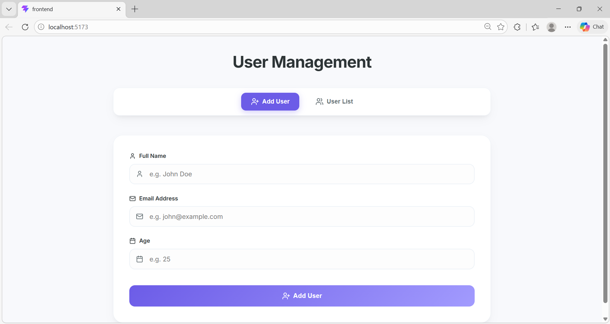
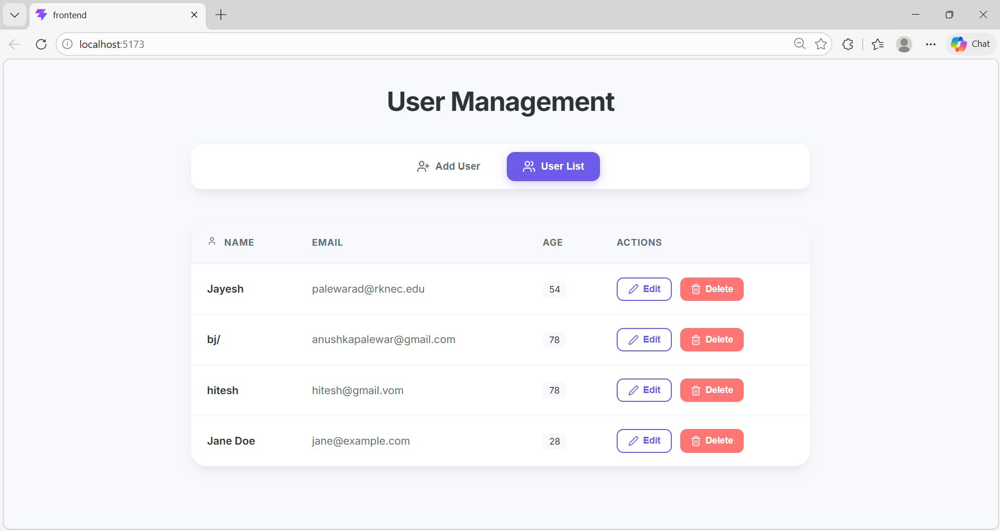
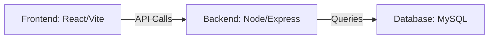
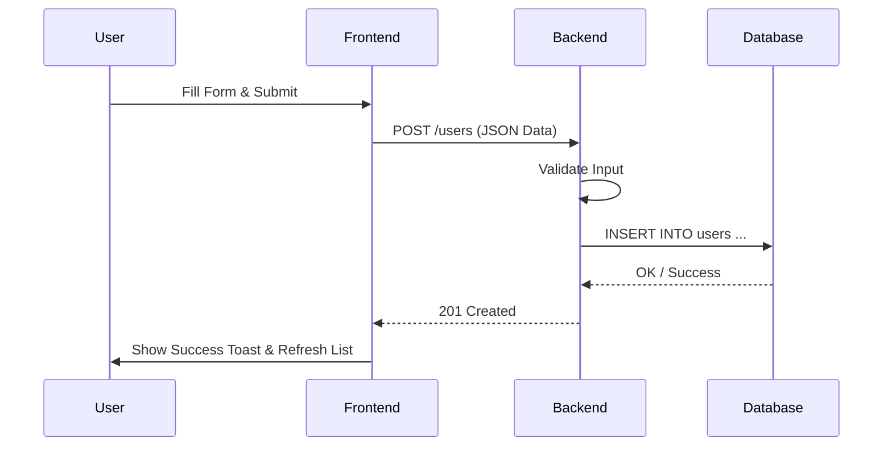

# UserHub - Modern User Management System

UserHub is a sleek, high-performance MERN stack application designed for seamless user management. It features a modern, responsive UI with smooth animations and a robust backend architecture.

## 🚀 Tech Stack

### Frontend
- **React 19** & **TypeScript**
- **Vite** (Optimized Build Tool)
- **Framer Motion** (Subtle Animations)
- **Lucide React** (Modern Iconography)
- **Vanilla CSS** (Custom Design System with CSS Variables)

### Backend
- **Node.js** & **Express.js**
- **TypeScript** (Strongly Typed API)
- **MySQL** (Relational Database)
- **mysql2** (Database Driver)

---

## ✨ Features

- **✅ Add User**: Create new user profiles with real-time feedback.
- **📋 View Users**: Dynamic dashboard to browse your user directory.
- **✏️ Update User**: Intuitive editing interface for existing records.
- **🗑️ Delete User**: Secure removal with interactive confirmation modals.
- **🛡️ Form Validation**: Comprehensive data verification for both frontend and backend.

---

## 🏗️ Project Structure

```text
root
 ├── frontend   # React + Vite client application
 └── backend    # Node.js + Express API service
```

---

## 🛠️ Setup Instructions

### 1. Clone the Repository
```bash
git clone https://github.com/anushka-palewar/UserManagement
```

### 2. Frontend Setup
```bash
cd frontend
npm install
npm run dev
```

### 3. Backend Setup
```bash
cd backend
npm install
npm run dev
```

---

## 🔑 Environment Variables

The backend requires a `.env` file with the following variables:

```env
PORT=5000
DB_HOST=localhost
DB_USER=root
DB_PASSWORD=your_password
DB_NAME=user_management
```

---

## 🔌 API Endpoints

| Method | Endpoint | Description |
| :--- | :--- | :--- |
| **POST** | `/users` | Create a new user |
| **GET** | `/users` | Retrieve all users |
| **PUT** | `/users/:id` | Update an existing user |
| **DELETE** | `/users/:id` | Delete a specific user |

---

## 🖼️ Screenshots

### Dashboard Overview



---

## 📊 Architecture

### System Flow


### User Interaction Sequence


---

## 📝 Notes

- Uses **Inter** as the primary typeface for a clean look.
- Implements **Glassmorphism** and **Glow Effects** for a premium feel.
- Fully responsive design optimized for mobile and desktop.
- Developed with **Markdown Best Practices** for high readability on GitHub.
